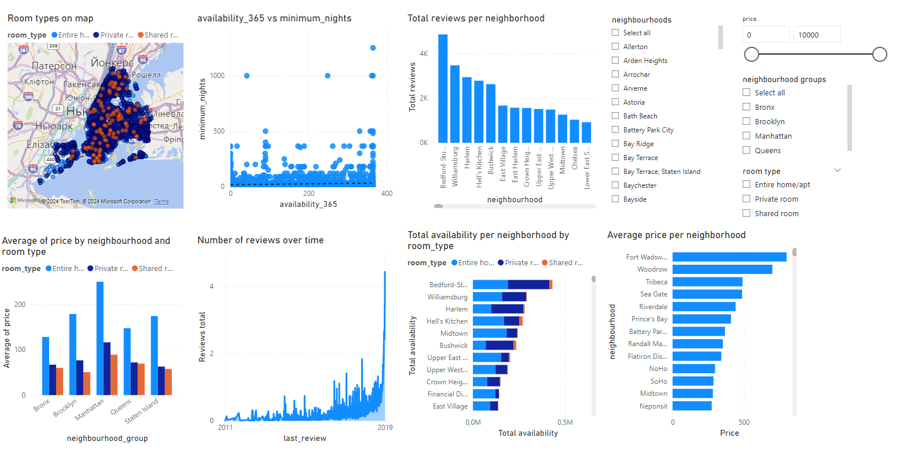

# Power BI homework

This is a report that ingests, transforms, and visualizes data from the NYC Airbnb dataset.

Data is transformed using Power Query:
1. Rows where price is 0 or negative are removed.
2. Last_review date is converted and filled if missed.
3. Missing reviews_per_month values are replaced with 0.
4. Rows without latitude or longitude are removed.

### Report result
